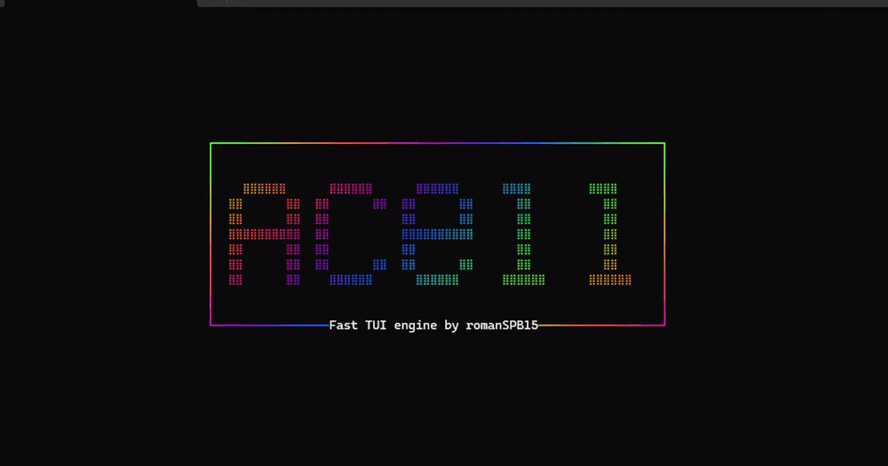

# acell

[](https://pkg.go.dev/github.com/romanSPB15/acell)
[](https://opensource.org/licenses/MIT)
[](./calc-coverage-noterm.ps1)
[](https://github.com/romanSPB15/acell/actions/workflows/test.yaml)
[](https://github.com/romanSPB15/acell/tree/main/examples)

**Низкоуровневый cell-based терминальный слой для Go.**

- 🎯 Полная поддержка мыши: клик, отпускание, движение, скролл (SGR 1006)
- 🚀 5000 FPS на бенчмарке — в 2 раза быстрее tcell v3
- 🎨 Автоматический downsampling цветов — TrueColor → 256 → 16 → 8 под возможности терминала
- 🎁 Windows без WSL, без CGO
- 📦 Всего две зависимости — `x/sys` и `x/term`
- ✅ 97% покрытие ядра тестами

<h3 align="center"><pre>go get github.com/romanSPB15/acell</pre></h3>

## Быстрый старт

```go
package main

import "github.com/romanSPB15/acell"

func main() {
	in, out := acell.Default()
	t := acell.New(in, out)
	defer t.Close()

	draw := func() {
		t.Clear()
		t.DrawString(0, 0, acell.Style{}, "Hello,")
		t.DrawString(7, 0, acell.Style{Fg: acell.FgRed, Args: acell.Bold}, "acell")
		t.DrawRune(12, 0, acell.Style{}, '!')
		t.DrawString(0, 2, acell.Style{Fg: acell.Fg16Grey}, "press q to quit")
		t.Flush()
	}

	draw()

	for ev := range t.Events() {
		switch e := ev.(type) {
		case *acell.KeyboardEvent:
			if e.Rune == 'q' || e.Key == acell.KeyCtrlC {
				return
			}
		case *acell.ResizeEvent:
			t.Buf = acell.NewBuf(e.Width, e.Height)
			t.Invalidate()
			draw()
		}
	}
}


```

## Как это работает

Модель рендера — буфер `[][]Cell` (`Terminal.Buf`) плюс теневая копия
(`oldBuf`). Каждый `Flush`:

1. Проходит по обоим буферам клетка за клеткой.
2. Для каждой изменившейся клетки пишет `CUP` (только если курсор ещё
   не там), затем дельту стиля, затем руну.
3. Кеширует предыдущий стиль и позицию курсора, чтобы не писать лишние
   последовательности.
4. Оборачивает кадр в mode 2026 (`CSI ?2026h` … `CSI ?2026l`) для
   атомарного обновления.

Весь вывод собирается в переиспользуемый `builder.Builder` — без промежуточных строк.

## Производительность

[Стресс-бенчмарк](https://github.com/romanSPB15/acell/blob/main/bench) — терминал 120×30, виджет 80×24, 300 изменяющихся клеток
на кадр, 8-цветов, Windows 10 x64, Windows Terminal, с учётом I/O:

| Реализация                            | Raw     |
|---------------------------------------|---------|
| **acell**                             | ~5000   |
| tcell v3.5.0                          | ~2450   |

## Пакеты

| Пакет     | Назначение                                       |
|-----------|--------------------------------------------------|
| `acell`   | `Terminal`, `Cell`, `Style`, diff-рендер         |
| `ansi`    | Парсинг ANSI-последовательностей: `Strip`, `Find`|
| `builder` | Аналог `strings.Builder` с расширенным API       |
| `term`    | `RawTerminal` и работа с терминалом              |

## Покрытие тестами

- Ядро: **97.0%**
- С учётом терминального слоя: 81.8%

```
./calc-coverage.ps1          # полное покрытие, включая term
./calc-coverage-noterm.ps1   # только ядро
```

## Лицензия

[MIT](./LICENSE)